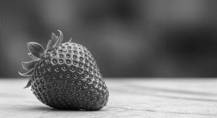
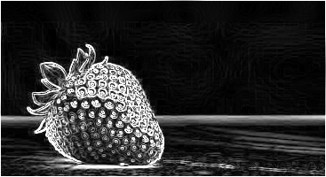

# 📸 imageproc

*A learning project to practice modern C++17 by building an image processing CLI tool.*  

---

## What’s implemented
- Load & save images (PNG/JPEG) using [stb_image](https://github.com/nothings/stb).  
- A command-line interface with a few filters:  
  - Negative  
  - Vertical flip  
  - Grayscale  
  - Blur (parallelized with `std::thread`)  
  - Edge detection (Sobel operator, parallelized)  

Example usage:  
```bash
./build/imgproc input.png output.png --filter grayscale
./build/imgproc --help   # list all filters
```

---

## Build instructions
Developed and tested on **Linux** (GCC/Clang).  
Requires **CMake** and a C++17 compiler.  

```bash
git clone git@github.com:ThanosKolt/imageproc.git
cd imageproc
mkdir build && cd build
cmake ..
make
```

Run tests (GoogleTest):  
```bash
ctest
```

---

## Results
Here are some example outputs:  

| Original | Grayscale |
|----------|-----------|
|  |  |

| Negative | Flip Vertical |
|----------|----------------|
|  |  |

| Blur     | Edge Detection |
|----------|----------------|
|  |  |